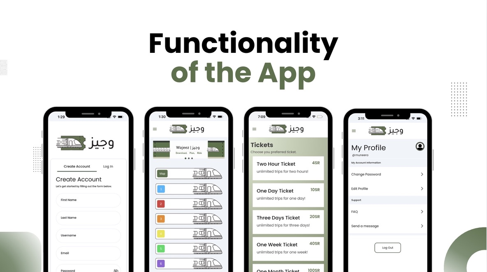

# Wajeez - Riyadh Metro Companion 🚇

**Wajeez** is an innovative metro system app created to enhance the daily commuting experience in Riyadh. Whether it’s booking tickets, managing transfers, exploring train stations, or receiving critical updates, Wajeez prioritizes the needs of commuters. 

> It’s not just an app! it’s a gateway to a seamless and user-friendly metro journey.

---

## Tech Stack
This project was developed as part of a **Software Engineering course**, focusing on scalability and user experience:
* **Frontend:** [FlutterFlow](https://flutterflow.io/)
* **Backend:** [Supabase](https://supabase.com/) (Database & Real-time updates)
* **Authentication:** Supabase Auth for secure user access.

## Key Features
* **Smart Booking:** Easy ticket purchase and management.
* **Station Explorer:** Navigate through Riyadh Metro stations effortlessly.
* **Real-time Updates:** Stay informed with critical transit notifications.
* **Seamless Transfers:** Simplified management for daily commuters.

## Live Demo
You can explore the interactive prototype here:
🔗 [Wajeez Web App](https://wajeez-app.flutterflow.app/)

## Academic Context
* **Course:** Software Engineering Project (CS1250 & CS1251).
* **University:** Imam Mohammad Ibn Saud Islamic University.

---
*Developed with Passion for Riyadh's Future Mobility.*
